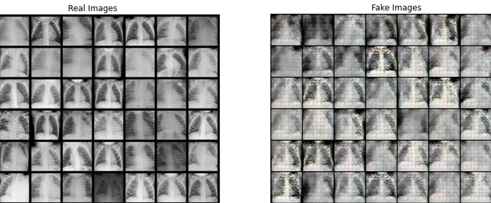
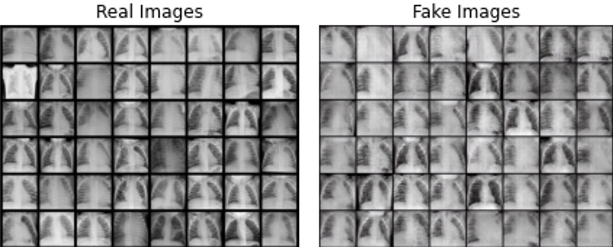

    
    

    <em> 100 Iteration (left) & 500 Iteration (right) </em>

# Deep-Fake medical image(X-ray) using GAN

------------------------------------------------------

## [Abstract]
The paper ["CT-GAN: Malicious Tampering of 3D Medical Imagery using Deep Learning"](https://arxiv.org/pdf/1901.03597v3.pdf) presented that the possibility of cyber attach on medicla records which leads to a serious damage on medical diagnosis process. This paper simulates the hypothetical attack by creating deep-fake X-ray images (Source: [Chest X-ray Images](https://data.mendeley.com/datasets/rscbjbr9sj/2)). The ResNet-18 model, which achieved 0.98 accuracy on the origianl dataset ([performance on teritary classification](https://github.com/JosephKBS/BMIN_DL)), performned much worse by 0.63, 0.57 and 0.55 (100, 200, and 500 iterations) on the fake images created by `GAN (Generative adversarial networks)`. The result reiterate the danger of deep learning-based methods.

------------------------------------------------------
## [Model]

- ResNet-18 model has trained with 20 epochs and the performance in binary task (Pneumonia detection) is as follows.

| Metric    | ResNet-18  | 
|-----------|------------|
| Acc(val)  | 0.98       | 
| Acc(test) | 0.98       | 
| AUC       | 0.98       |
| F1        | 1.00       | 

- The model applied to perform the same task for images generated by the GAN (Generative adversarial networks).

------------------------------------------------------
## [Summary table of model-performance]

| Metric    | Iter100  | Iter200 | Iter500  | 
|-----------|----------|---------|----------|
| Accuracy  | 0.63     | 0.57    | 0.55     | 

    - Iter100 = 100 iteration of epochs 
    - Iter200 = 200 iteration of epochs 
    - Iter500 = 500 iteration of epochs 
- ResNet-18 model performance dropped significantly with the fake data generated by the GAN (Generative adversarial networks).

## [Reference]

- Yisroel Mirsky, Tom Mahler, Ilan Shelef, Yuval Elovici (2019) "CT-GAN: Malicious Tampering of 3D Medical Imagery using Deep Learning",  28th USENIX Security Symposium (USENIX Security 2019). [paper link](arXiv:1901.03597)
- Kermany, Daniel; Zhang, Kang; Goldbaum, Michael (2018), “Labeled Optical Coherence Tomography (OCT) and Chest X-Ray Images for Classification”, Mendeley Data, V2, doi: 10.17632/rscbjbr9sj.2. [paper link](10.17632/rscbjbr9sj.2)
