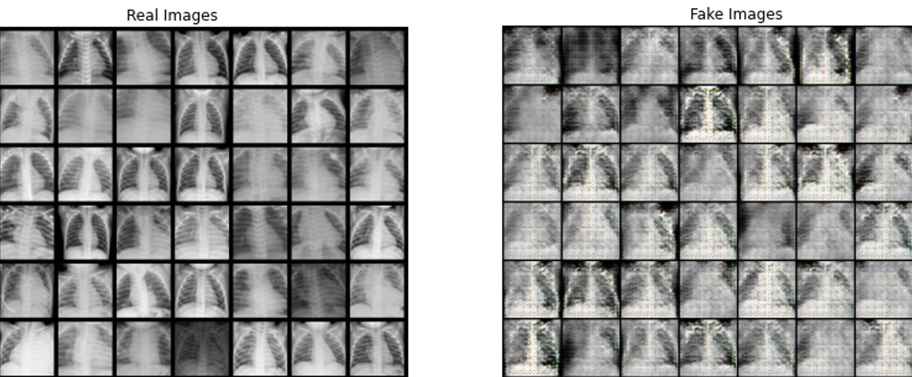
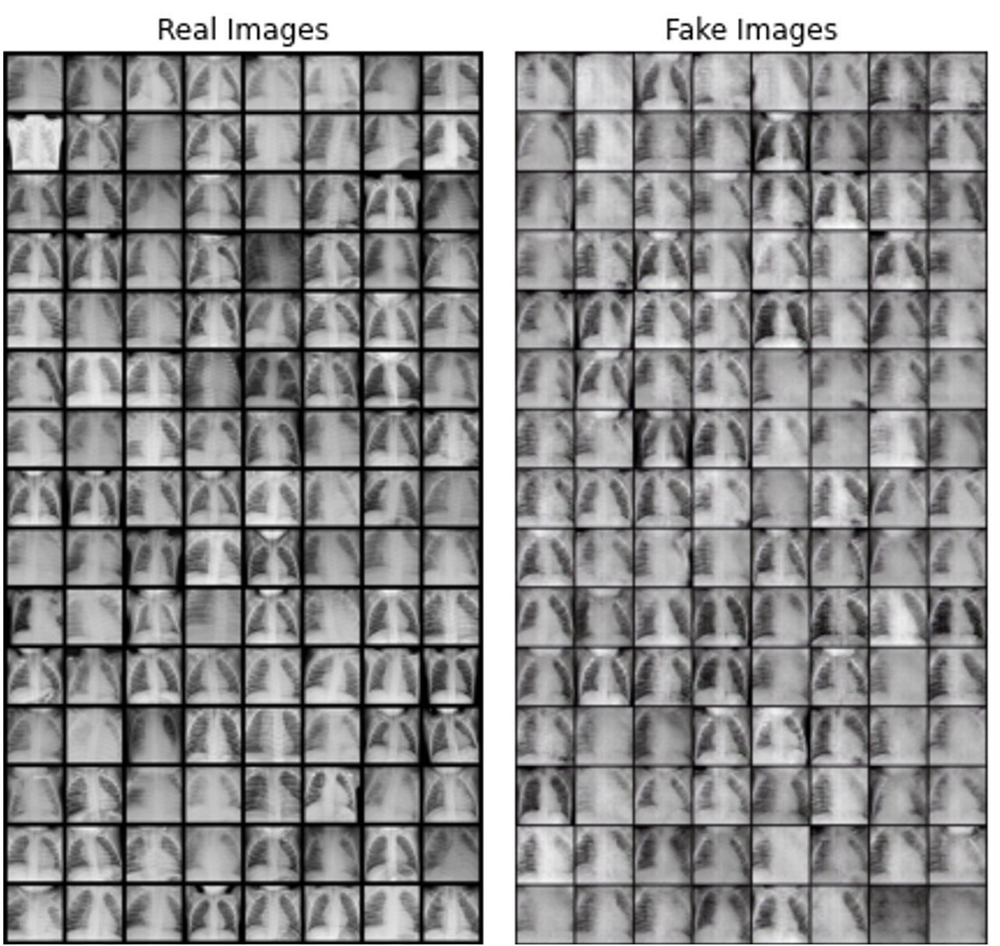

    
    
    <em> 100 Iteration (left) & 500 Iteration (right) </em>

# Deep-Fake medical image(X-ray) using GAN

- This is README file for the paper "Pneumonia Chest X-ray Image Classification". This paper is a final project report for the Deep learning in Medicine (BMIN-GA 3007) at Department of Biomedical Informatics at NYU Grossman School of Medicine.
------------------------------------------------------

## [Abstract]

------------------------------------------------------
## [Table of contents]

- 1. Data preprocessing
- 2. Model Training
    - 2.1. Simple CNN Model 
    - 2.2. BatchNorm model
    - 2.3. ResNet-18 Model
    - 2.4. Inception V3 Model with 10 epochs

------------------------------------------------------
## [Result]

- A summary tabke of model-performance

| Metric    | CNN  | BATCH | R18  | R18B | R50  | IV3  | IV3B |
|-----------|------|-------|------|------|------|------|------|
| Acc(val)  | 0.77 | 0.79  | 0.78 | 0.83 | 0.79 | 0.78 | 0.81 |
| Acc(test) | 0.76 | 0.70  | 0.80 | 0.79 | 0.76 | 0.76 | 0.81 |
| AUC       | 0.87 | 0.87  | 0.91 | 0.91 | 0.89 | 0.88 | 0.91 |
| F1        | 0.71 | 0.70  | 0.78 | 0.77 | 0.75 | 0.73 | 0.77 |

    - BATCHNORM (BatchNorm model), R18(ResNet-18), R18B(ResNet-18 with class balanced), R50 (ResNet-50), IV3 (Inception V3), IV3B (Inception V3 with class balanced)
